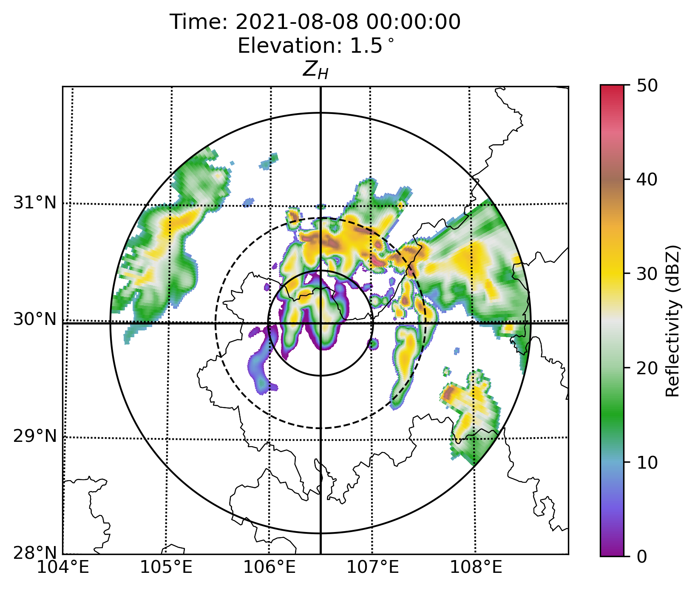
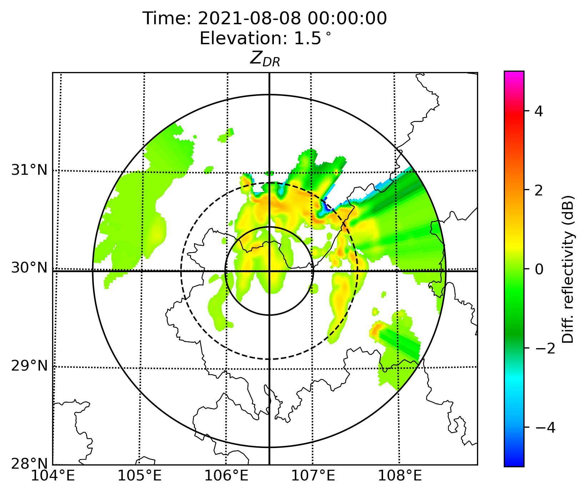
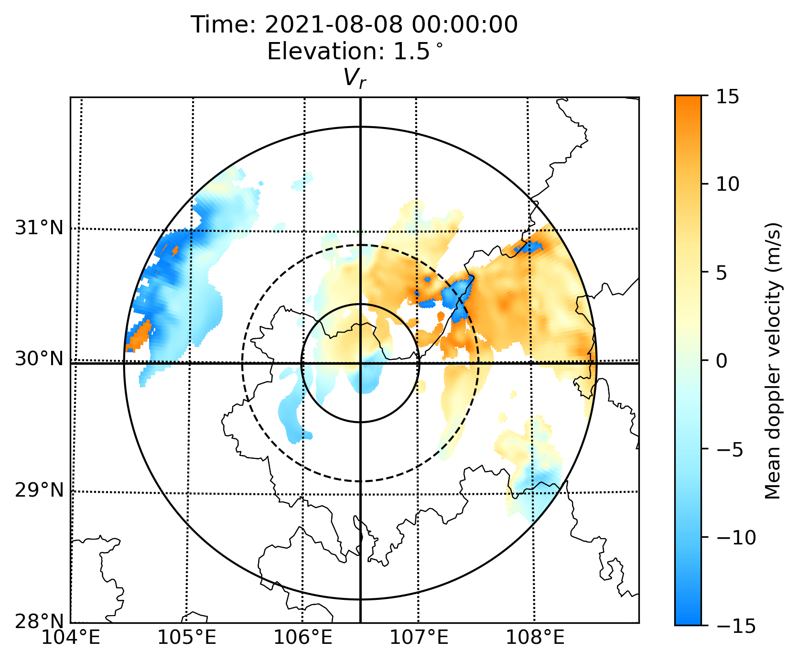
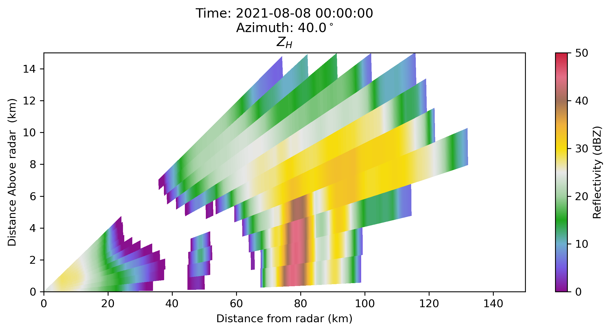
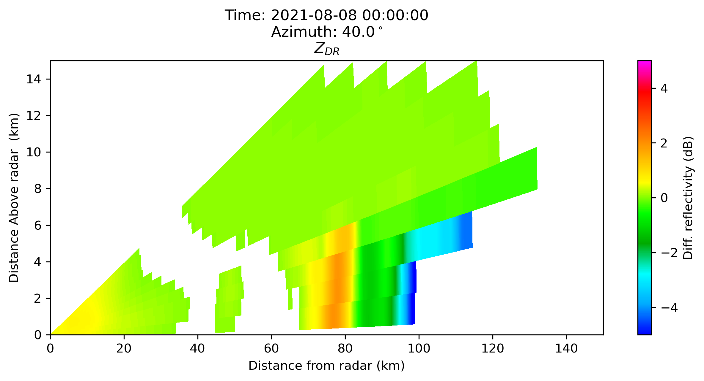
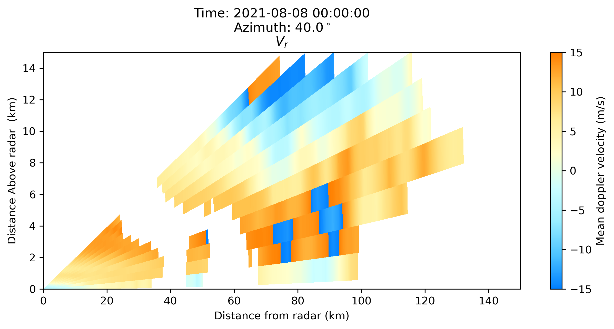
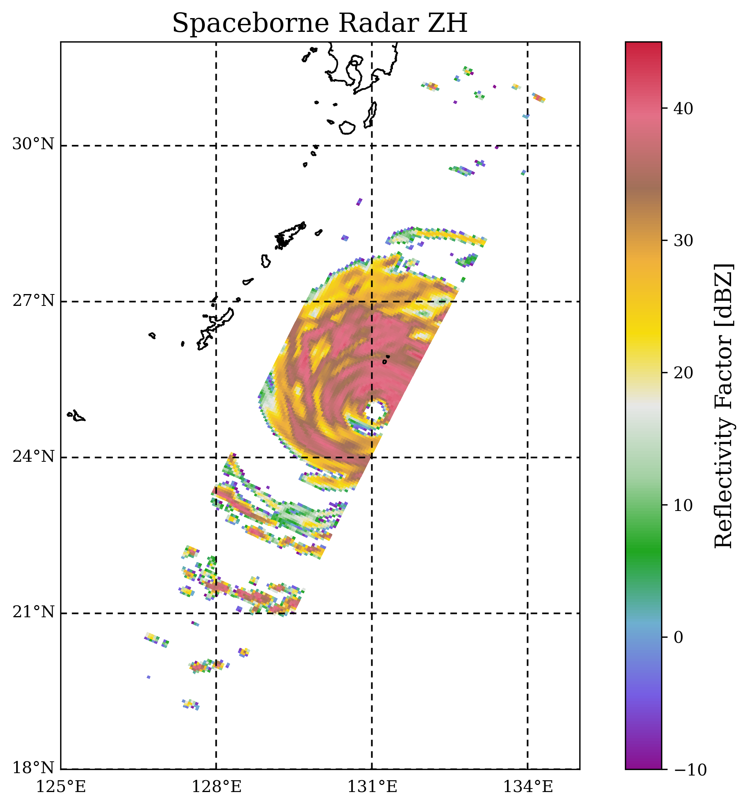
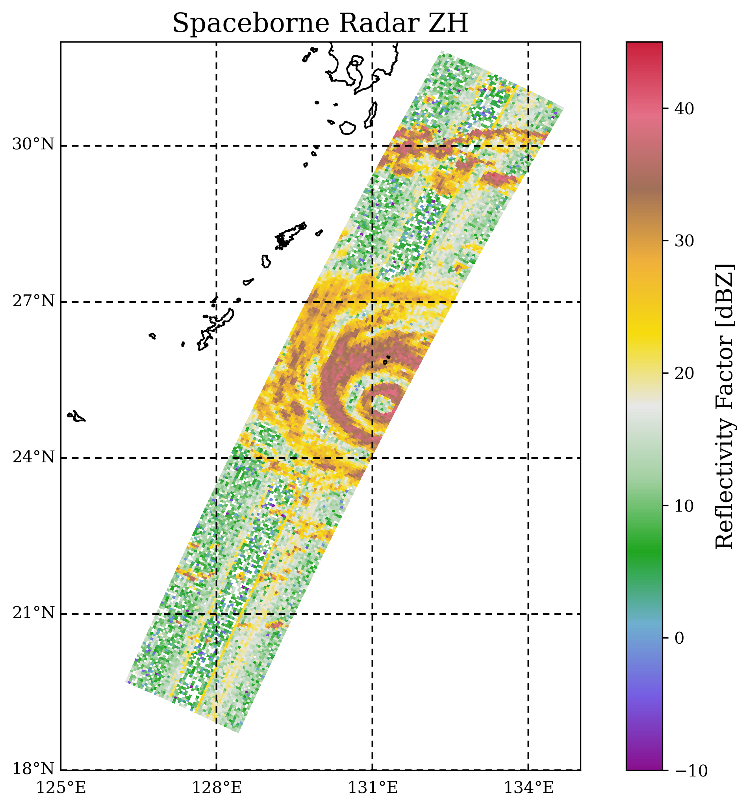
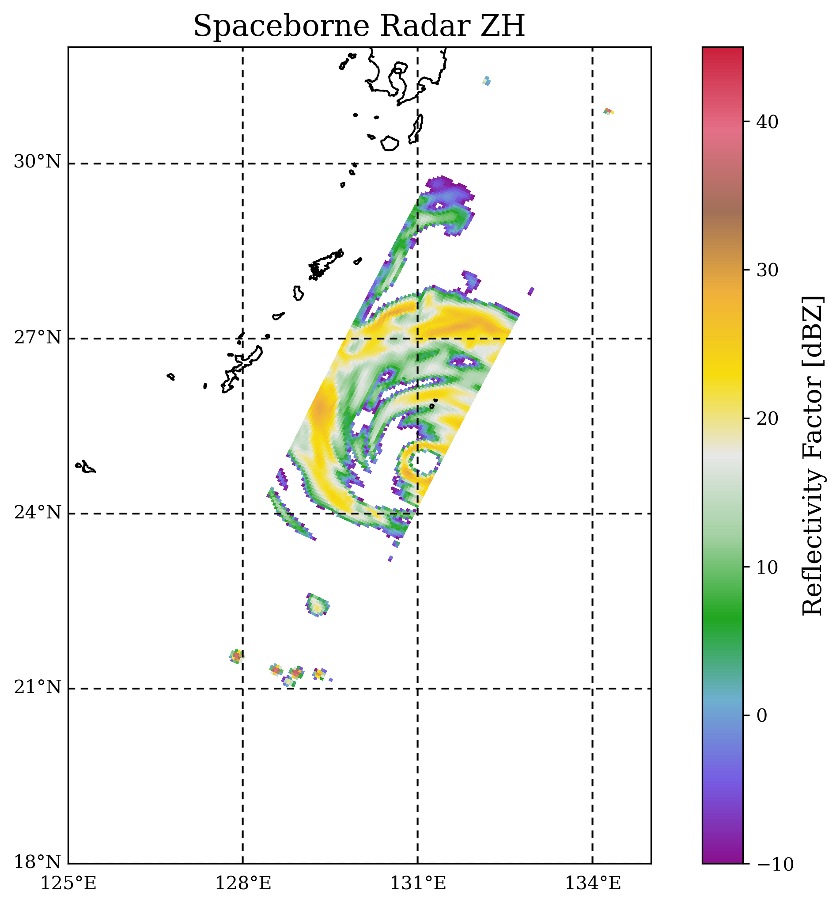
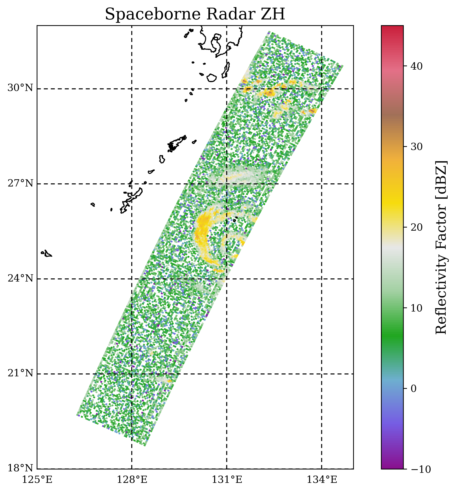

<!--
 * @Description: Readme for ZJU_AERO
 * @Author: Hejun Xie
 * @Date: 2020-04-06 20:52:07
 * @LastEditors: Hejun Xie
 * @LastEditTime: 2021-10-21 20:34:14
 -->
# ZJU_AERO (Accurate and Efficient Radar Operator)
Supports state of the art simulations of dual-polarimetric radar observable varibales.

 - [Developers and contributors](CONTRIBUTORS.txt)

## Install
### 1. Install SWIG
This project use `swig` to build C extensions. So check if you have installed swig.
If not, then install it with:
```
    $sudo apt-get install swig
```

### 2. Create conda environment for ZJU_AERO
With Anaconda or Miniconda install, it is recommended to create a new conda environment when using ZJU_AERO or even other packages.  
To create a new environment based on the environment.yml:

```
    $conda env create -f environment.yml
```

Install the radar ploting package to plot the simulation results, 
Currently ZJU_AERO supports those two packages:
* `arm_pyart`, please see https://github.com/ARM-DOE/pyart;
* `pycwr`, please see https://github.com/YvZheng/pycwr;  
For example, you can install arm_pyart with
```
    $conda install -c conda-forge arm_pyart
```

### 3. Install the ZJU_AERO packge
Install from downloaded release package ZJU_AERO_x.y.z.tar.gz with:

```
    $tar -zxvf ZJU_AERO_<x.y.z>.tar.gz
    $cd ZJU_AERO_<x.y.z>
    $python setup.py install
```

## Quick Start

**To get started using ZJU_AERO, you need to first get your LUT and model file right in place**

* **Hydrometeor Back Scattering Look-up Table**  
For test cases, we place the lookup-table under the following directory:  
You can specify the `db_name` in option_files: `microphysics - folder_lut`
```
    ZJU_AERO_<x.y.z>/pathos/lut/<db_name>/lut_SZ_<H>_<Freq>_<Freq>_<mp_scheme>_Level<A/B/C>.nc
```

* **NWP Model Output Including Hydrometeor 3D Fields**  
ZJU_AERO supports two kind of NWP model output: **GRAPES** and **WRF**  
You can specify the `model_name` in option_files: `nwp - name`  
Take WRF as example, we place the wrfout file for test cases under directory:  
```
    ZJU_AERO_<x.y.z>/pathos/WRF/thompson/wrfout_xxxx.nc
```

* **Example1: PPI Scan Simulation**  
    * Test Script: `example/ppi.py`
    * User Option File: `exmple/option_files/example.yml`
    * WRF Model File: `pathos/WRF/thompson/wrfout_d02_2021-08-08_00_00_00`
    * LUT for Grauel, Cloud Ice, Snow and Rain: 
      * `pathos/lut/tm_masc_release/lut_SZ_G_9_41_1mom_LevelB.nc`
      * `pathos/lut/tm_masc_release/lut_SZ_I_9_41_1mom_LevelB.nc`
      * `pathos/lut/tm_masc_release/lut_SZ_S_9_41_1mom_LevelB.nc`
      * `pathos/lut/tm_masc_release/lut_SZ_R_9_41_1mom_LevelB.nc`
    ```
    $ cd example
    $ python ppi.py
    ```

    * Plotted PPI Scan `Reflectivity` $Z_{H}$
    

    * Plotted PPI Scan `Differential Reflectivity` $Z_{DR}$
    

    * Plotted PPI Scan `Radial Velocity` $V_{r}$
    

* **Example2: RHI Scan Simulation**  
    * Test Script: `example/rhi.py`
    * User Option File: `exmple/option_files/example.yml`
    * WRF Model File: `pathos/WRF/thompson/wrfout_d02_2021-08-08_00_00_00`
    * LUT for Grauel, Cloud Ice, Snow and Rain: 
      * `pathos/lut/tm_masc_release/lut_SZ_G_9_41_1mom_LevelB.nc`
      * `pathos/lut/tm_masc_release/lut_SZ_I_9_41_1mom_LevelB.nc`
      * `pathos/lut/tm_masc_release/lut_SZ_S_9_41_1mom_LevelB.nc`
      * `pathos/lut/tm_masc_release/lut_SZ_R_9_41_1mom_LevelB.nc`
    ```
    $ cd example
    $ python rhi.py
    ```

    * Plotted RHI Scan `Reflectivity` $Z_{H}$
    

    * Plotted RHI Scan `Differential Reflectivity` $Z_{DR}$
    

    * Plotted RHI Scan `Radial Velocity` $V_{r}$
    

* **Example3: Spaceborne Scan Simulation**  
    * Test Script: `example/spaceborne.py`
    * User Option File: `exmple/option_files/example_spaceborne.yml`
    * WRF Model File: `pathos/GRAPES/typhoon_haishen_20200905/modelvar202009050000900.nc`
    * LUT for Grauel, Cloud Ice, Snow and Rain: 
      * `pathos/lut/tm_masc_release/lut_SZ_G_13_6_1mom_LevelB.nc`
      * `pathos/lut/tm_masc_release/lut_SZ_I_13_6_1mom_LevelB.nc`
      * `pathos/lut/tm_masc_release/lut_SZ_S_13_6_1mom_LevelB.nc`
      * `pathos/lut/tm_masc_release/lut_SZ_R_13_6_1mom_LevelB.nc`
    ```
    $ cd example
    $ python spaceborne.py
    ```

    * Simulated Spaceborne Scan `Reflectivity` $Z_{H}$ at 0km altitude
    

    * Observed Spaceborne Scan `Reflectivity` $Z_{H}$ at 8km altitude
    

    * Simulated Spaceborne Scan `Reflectivity` $Z_{H}$ at 0km altitude
    

    * Observed Spaceborne Scan `Reflectivity` $Z_{H}$ at 8km altitude
    

For more Details and examples, please read [User_Guide](doc/User_Guide-ZJU_AERO-0.1.4.pdf) 

Project development plan
----------

- [ ] Melted Ice simulation
- [x] Thompson Microphysics constants
- [ ] Online Documentation
 